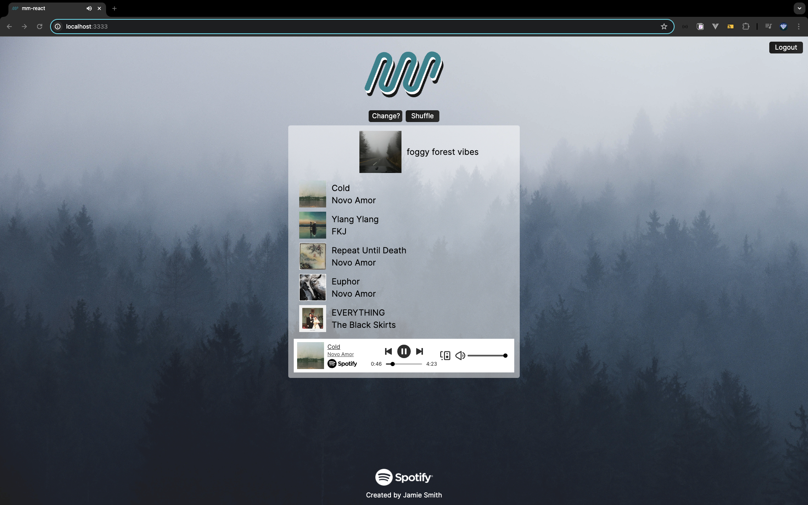

# Music Meteorologist
> Playlists curated for your local weather powered by Spotify 
## Overview
**Music Meteorologist is a web application that allows users to input their location and receive a playlist based on the current weather conditions. The application uses the OpenWeatherMap API to get the weather data and the Spotify API to get the song/playlist data.**

## Features
- Login or sign up for Spotify
- Input your location by zip code, name of city, or lat/long
- Receive a playlist based on the current weather conditions
- Begin playing the playlist automatically in browser
- Select individual songs to play
- Change and browse different locations
- Receive a different playlist if user doesn't like the current one
- Spotify player controls in browser to play, pause, skip, go back, change volume, and select different speaker output

## Stack
- React
- Node.js
- Express | Cors | Axios
- Less | unoCSS
- [Spotify-Web-Api-Node](https://github.com/thelinmichael/spotify-web-api-node/)
- [React-Spotify-Web-Playback](https://github.com/gilbarbara/react-spotify-web-playback)

### APIs
- [OpenWeatherMap API](https://openweathermap.org/api)
- [Spotify API](https://developer.spotify.com/documentation/web-api/)


## Installation

### Prerequisites

You'll need to have Node (version 22.x.x) and npm installed.

```bash
npm install -g pnpm
```

### Install dependencies

Pull the repo down and navigate to `client` folder, then run:

```bash
pnpm install
```

repeat above steps for `server` folder

## Run the app
### Run the app locally

in `client` folder:
```bash
npm run serve
```
in `server` folder:
```bash
npm run start  
```

This will host the app on `http://localhost:3333`.

## Project Screenshots





## Authors
Code and Design by Jamie Smith | [@notjimjam](https://github.com/notjimjam) | [LinkedIn](https://www.linkedin.com/in/jamiemsmithdev/)
